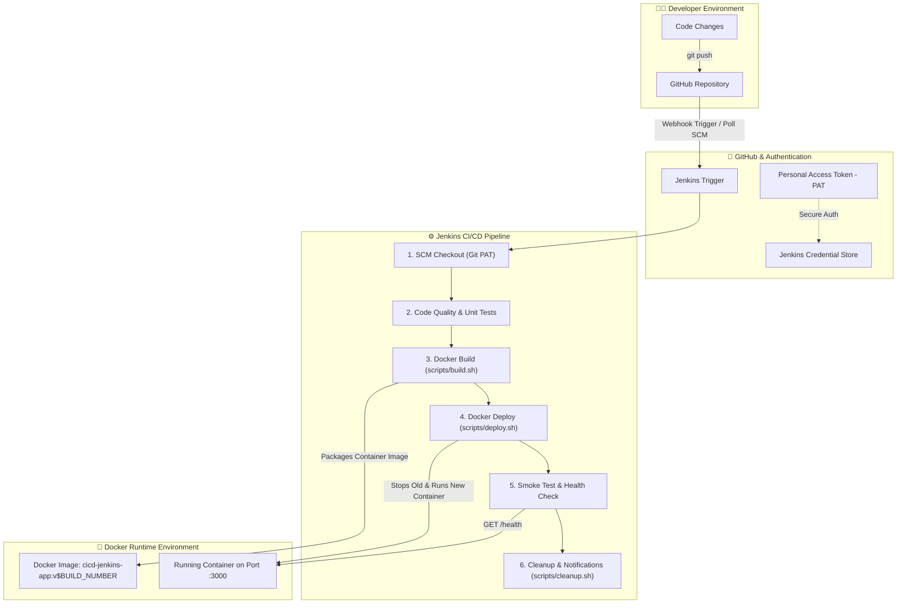

# 🚀 CI/CD Pipeline Automation: Jenkins | Docker | GitHub | Bash

[](https://jenkins.io/)
[](https://www.docker.com/)
[](https://github.com/)
[](https://www.gnu.org/software/bash/)
[](https://nodejs.org/)

---

## 📌 Project Overview & Key Highlights

This repository contains an enterprise-ready **Continuous Integration and Continuous Deployment (CI/CD)** pipeline designed to automate the testing, building, containerization, and zero-downtime deployment of applications from GitHub to target host environments using **Jenkins**, **Docker**, and **Bash**.

### 🌟 Key Highlights
* **Automated CI/CD Pipeline**: Designed and implemented a Declarative Jenkins pipeline to automatically build, test, and deploy Dockerized applications upon code changes pushed to GitHub.
* **Secure PAT Authentication**: Configured Jenkins credentials using a **GitHub Personal Access Token (PAT)** for secure, encrypted repository authentication without exposing raw credentials.
* **Automated Docker Lifecycle**: Orchestrated Docker image builds with version tagging (`v${BUILD_NUMBER}`) and automated container deployment via modular pipeline stages.
* **Eliminated Manual Deployment Effort**: Integrated GitHub Webhooks, Jenkins Pipeline, Docker Build, and Docker Run into a single frictionless automated workflow.
* **Automated Health Verification**: Post-deployment smoke tests verify HTTP status (`/health`) and endpoint availability with automated failure diagnostics and log dumping.

---

## 🏗️ Architecture & Workflow Diagram



---

## 📁 Repository Structure

```text
├── .dockerignore           # Exclusions for Docker build context
├── .gitignore              # Git ignore rules for node_modules and logs
├── Dockerfile              # Multi-stage production container definition
├── docker-compose.yml      # Local orchestration configuration
├── Jenkinsfile             # Declarative Jenkins CI/CD Pipeline definition
├── package.json            # Node.js project manifest & scripts
├── README.md               # Comprehensive documentation
├── public/                 # Static assets & dashboard interface
│   └── index.html          # Dynamic live deployment dashboard
├── src/                    # Application source code
│   └── server.js           # Express API server with /health endpoint
├── tests/                  # Automated test suite
│   └── test.js             # Pipeline unit & smoke test suite
└── scripts/                # Modular Bash automation scripts
    ├── build.sh            # Automated Docker image build script
    ├── deploy.sh           # Zero-downtime container deploy & health check
    └── cleanup.sh          # Disk cleanup & dangling image pruning
```

---

## 🔄 How the CI/CD Pipeline Works (Step-by-Step)

```
[Developer Push] ➡️ [GitHub Webhook] ➡️ [Jenkins Pipeline] ➡️ [Docker Image] ➡️ [Live Application]
```

### Stage 1: SCM Checkout
* Jenkins receives a trigger (or polls GitHub).
* Authenticates using the configured **GitHub Personal Access Token (`github-pat-credentials`)**.
* Clones the repository and extracts the short commit SHA for audit tracking.

### Stage 2: Code Quality & Unit Tests
* Executes `npm install` and runs `tests/test.js`.
* Validates server routes, `/health` response, and metadata payload schemas.
* **Fails fast**: If any test fails, the build halts immediately, preventing faulty code from reaching container build.

### Stage 3: Docker Build
* Invokes `scripts/build.sh`.
* Packages the application into an optimized Alpine-based Docker image.
* Tags the image with both the unique build identifier (`cicd-jenkins-app:v${BUILD_NUMBER}`) and `latest`.

### Stage 4: Docker Deploy
* Invokes `scripts/deploy.sh`.
* Inspects running Docker containers.
* Gracefully stops and removes previous container instances (`cicd-jenkins-container`).
* Starts the newly built container with restart policies, port binding (`3000:3000`), and environment configurations.

### Stage 5: Smoke Test & Health Verification
* Queries the live container endpoint (`http://localhost:3000/health`) through automated retry loops.
* Verifies `{"status":"UP"}`. If unhealthy, the pipeline triggers failure alerts and dumps container logs for root-cause analysis.

### Post-Build Stage: Cleanup & Maintenance
* Invokes `scripts/cleanup.sh` on the host to prune dangling images and prevent storage exhaustion.

---

## ⚙️ Jenkins Setup & Configuration Guide

### 1. Prerequisites
* **Jenkins Server** (v2.300+ recommended)
* **Docker Engine** installed on the Jenkins server
* **Git** installed on the Jenkins server

### 2. Grant Docker Permissions to Jenkins
Ensure the `jenkins` user has permission to execute Docker commands:
```bash
sudo usermod -aG docker jenkins
sudo systemctl restart jenkins
```

### 3. Generate GitHub Personal Access Token (PAT)
1. Go to **GitHub** ➡️ **Settings** ➡️ **Developer Settings** ➡️ **Personal Access Tokens** ➡️ **Tokens (classic)**.
2. Click **Generate new token**.
3. Select scopes:
   - `repo` (Full control of private repositories)
   - `admin:repo_hook` (For webhook management)
4. Copy the generated token.

### 4. Configure Credentials in Jenkins
1. Open Jenkins Dashboard ➡️ **Manage Jenkins** ➡️ **Credentials** ➡️ **System** ➡️ **Global credentials**.
2. Click **Add Credentials**:
   - **Kind**: `Username with password`
   - **Username**: Your GitHub username
   - **Password**: Your GitHub **Personal Access Token (PAT)**
   - **ID**: `github-pat-credentials` *(matches the ID in Jenkinsfile)*
   - **Description**: `GitHub PAT for CI/CD Pipeline`
3. Click **Create**.

### 5. Create the Jenkins Pipeline Job
1. In Jenkins Dashboard, click **New Item**.
2. Enter item name (e.g. `CICD-Docker-Pipeline`), select **Pipeline**, and click **OK**.
3. Scroll down to the **Pipeline** section:
   - **Definition**: `Pipeline script from SCM`
   - **SCM**: `Git`
   - **Repository URL**: `https://github.com/<YOUR_USERNAME>/<YOUR_REPO_NAME>.git`
   - **Credentials**: Select `github-pat-credentials`
   - **Branch Specifier**: `*/main` (or `*/master`)
   - **Script Path**: `Jenkinsfile`
4. Click **Save**.

### 6. (Optional) Configure Automatic Webhook Trigger
1. In your GitHub repository, go to **Settings** ➡️ **Webhooks** ➡️ **Add webhook**.
2. **Payload URL**: `http://<YOUR_JENKINS_HOST>:8080/github-webhook/`
3. **Content type**: `application/json`
4. Select **Just the push event**.
5. In Jenkins Pipeline configuration, check **GitHub hook trigger for GITScm polling**.

---

## 💻 Local Development & Testing

You can run and test the application and scripts locally before pushing:

### 1. Run with Node.js directly
```bash
npm install
npm test
npm start
# Open http://localhost:3000
```

### 2. Run with Docker
```bash
# Build the image
./scripts/build.sh cicd-jenkins-app 1.0.0

# Deploy the container
./scripts/deploy.sh cicd-jenkins-app 1.0.0 cicd-jenkins-container 3000

# Access the application
curl http://localhost:3000/health
```

### 3. Run with Docker Compose
```bash
docker compose up -d --build
# Open http://localhost:3000


## 🛡️ Best Practices Implemented
* ✅ **Non-root Docker execution**: Uses `USER node` for secure container runtime.
* ✅ **Healthcheck integration**: Built-in container and pipeline-level health verification.
* ✅ **Secure Credential Masking**: GitHub PAT managed via Jenkins credential store.
* ✅ **Zero-Downtime Re-deployment**: Container lifecycle script manages stop, prune, start, and verification.
* ✅ **Resource Retention Policy**: Jenkins log rotator keeps recent builds without eating host disk space.
